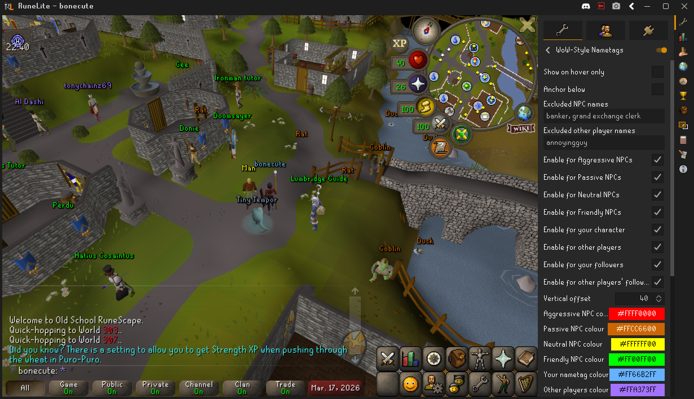
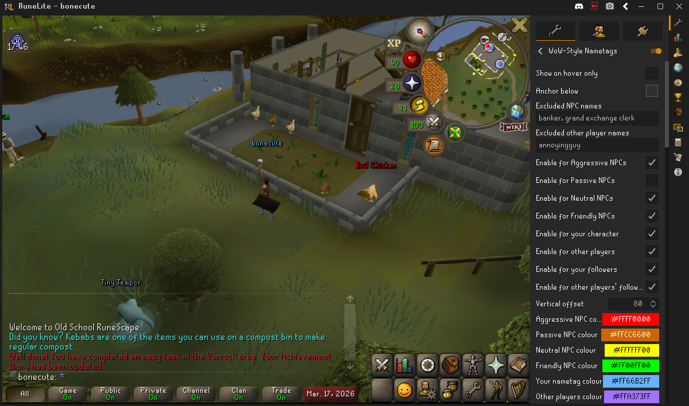
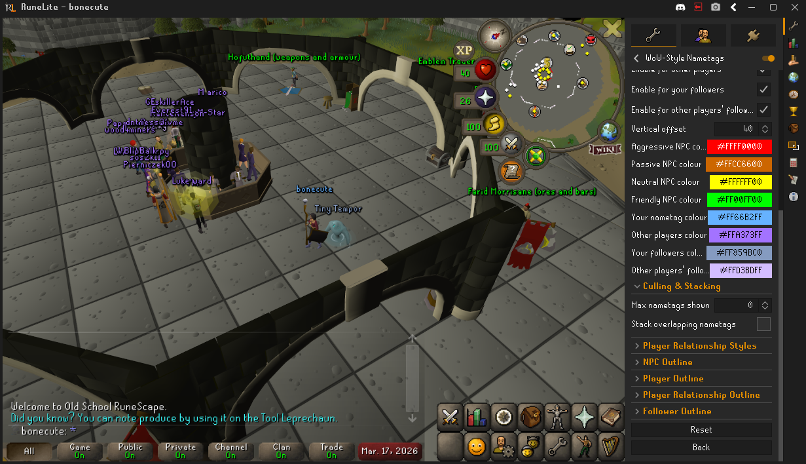
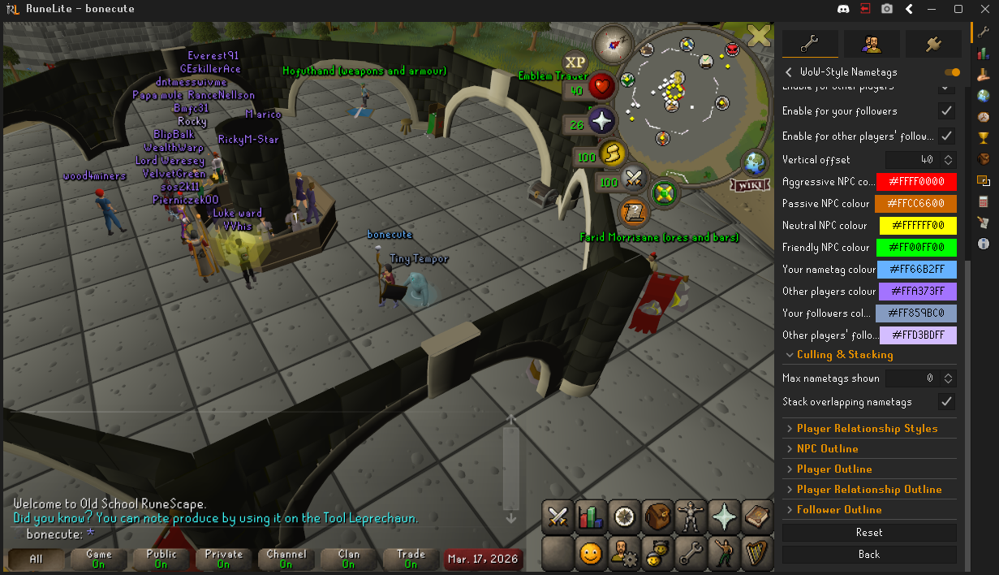
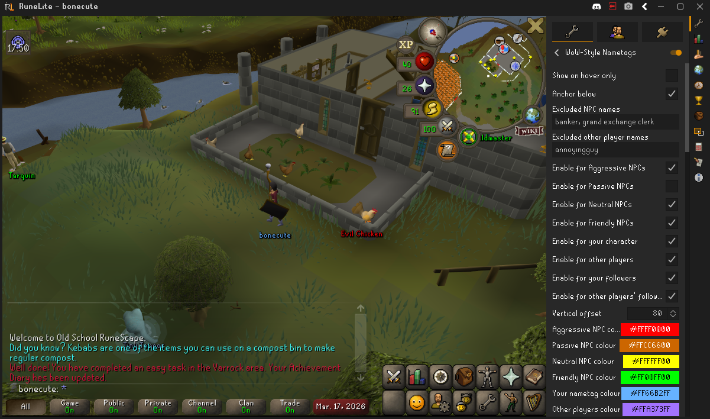

# WoW-Style Nametags

Displays floating nametags above NPCs and players in a style inspired by World of Warcraft. Each entity type can be made visible or hidden and is configurably colour-coded to make it immediately clear whether an NPC is aggressive, passive, neutral, or friendly - never right-click EVER again (slight exaggeration).

## Features

### Colour-coded NPC classification
NPCs are automatically classified and coloured by their type:

| Category | Default colour | Description |
|---|---|---|
| Aggressive | Red | Attackable NPCs that are currently targeting you, learned always-aggressive NPC types, or high-threat attack-only NPCs |
| Passive | Orange | Attack-only NPCs at or below the non-aggro threshold (combat level at most 2x yours) |
| Neutral | Yellow | NPCs that are both attackable and have a non-attack interaction ('Talk-to' or other interactions) |
| Friendly | Green | NPCs with a 'Talk-to' option (e.g. random towns folk, quest NPCs) |
| Friendly non-talkers | Pink | NPCs with non-attack interactions that are not 'Talk-to' (e.g. Catch, Shear, Pet) |
| Shopkeepers | White | NPCs with a 'Trade' interaction option |

Notes:
- Examine-only NPCs are hidden by default to avoid false positives (for example, trees/resource-like entities).
- Some always-aggressive NPC types are learned per session after first observed aggro due to RuneLite API limitations. Player-initiated attacks are excluded from this learning.

### Player & follower nametags
- **Your character**
- **Other players**
- **Your followers** (e.g. Pets, Cats)
- **Other players' followers**

### Player relationship styles
Optionally style the following groups separately from other players:
- **Friends**
- **Clan members**
- **Clan members (Guest)** (members of the clan channel you joined as a guest)
- **Guests in your clan** (guest players in your clan channel)
- **Chat channel members**

If a player matches multiple groups, this priority is used:
**Friends > Clan members > Clan members (Guest) > Guests in your clan > Chat channel members > Other players**

### NPC name exclusions
You can hide nametags for specific NPC names regardless of other toggles using a comma-separated list, for example:
`banker, man`

### Other player name exclusions
You can hide nametags for specific other players regardless of other toggles using a comma-separated list, for example:
`zezima, bonecute`

### Entity hider compatibility
Optionally hide nametags when another render-hiding plugin suppresses the underlying actor, which makes this play nicely with plugins such as Dynamic Entity Hider.

### Hover-only
Optionally hide all nametags until you move your cursor over an entity. Your own nametag remains visible regardless if enabled.

### Distance-based culling
Limit the number of nametags shown at once. Nametags are sorted by distance, closest entities always shown first. Set to 0 for unlimited (default: 0).

### WoW-style vertical stacking
When multiple nametags would overlap on screen, they are automatically shifted vertically so no two tags obscure each other - like in World of Warcraft. The closest entity keeps its default position; further entities stack above (or below, based on your anchor setting).

From this...

...to this!

### Colour & outline customisation
Every category has its own independently configurable:
- Label colour
- Font size
- Outline toggle, colour, and thickness

### Position control
- **Anchor above / below** — place the label above or below the entity
- **Vertical offset** — fine-tune the exact pixel distance from the entity

---

Current version: 1.4